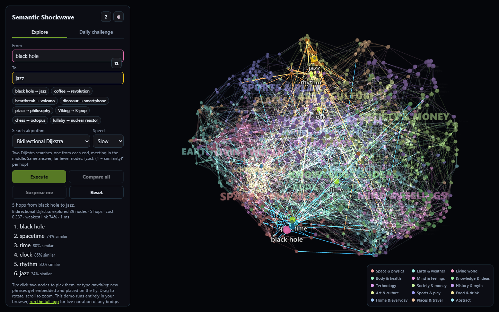
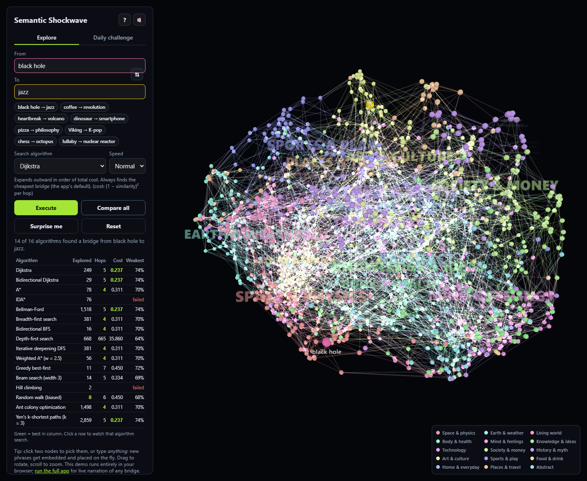
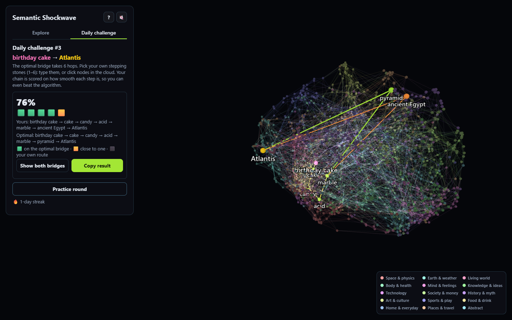

# Semantic Shockwave

[](https://github.com/alex-in-CS/semantic-shockwave/actions/workflows/ci.yml)
[](https://alex-in-cs.github.io/semantic-shockwave/)
[](LICENSE)

**A 3D map of 1,518 ideas, arranged by meaning. Pick two, say *black hole* and
*jazz*, choose one of 16 search algorithms, and watch it hunt for the chain of
stepping stones between them. Then two particle streams collide and the blast
throws every unrelated idea to the edge of the universe, leaving the bridge
glowing in the middle, explained hop by hop.**

> black hole → spacetime → time → clock → rhythm → jazz

Semantic Shockwave treats language as geometry. An embedding model turns each
concept into a 384-dimensional vector, UMAP projects them into a 3D cloud you
can fly through, and a nearest-neighbour graph links them up, so the shortest
path between two ideas is their *semantic bridge*. You can also type any phrase
at all ("my first heartbreak"): it's embedded on the fly and dropped into the
cloud.

### ▶ [Try the live demo](https://alex-in-cs.github.io/semantic-shockwave/)

It runs entirely in your browser: no server, no sign-up.


| Watching a search | Compare all 16 algorithms |
|---|---|
|  |  |
| **Daily challenge** | **Phone layout** |
|  |  |

---

## What you can do

- **Explore** a cloud of 1,518 concepts in 15 colored regions (Space & physics, Mind & feelings, Food & drink…), each node labelled. Labels fade in as you zoom; hover any node for its name and region, click the legend to light up one region.
- **Bridge any two ideas**, from the list or typed freely. Type any phrase and it's embedded, placed in the cloud and tagged `NEW`.
- **Pick from 16 search algorithms** and watch them explore in 3D: visited nodes light up, frontier edges glow, bidirectional searches show two colored waves meeting, ant colonies leave pheromone trails, and Yen's algorithm shows the three best bridges at once.
- **Compare all** algorithms on the same pair: nodes explored, hops, path cost and weakest link, best in each column highlighted. Click a row to watch that one.
- **Take the tour**: after the blast, the camera visits each hop with a one-sentence explanation of why the two ideas connect (LLM narration).
- **Play the daily challenge**: Bridge Builder gives you two far-apart ideas and you pick the stepping stones. Your chain is scored against the optimal bridge, with a Wordle-style shareable result. Since your steps don't have to be graph edges, a clever chain can beat the algorithm.
- **Share** any bridge: the URL (`?from=coffee&to=revolution&algo=astar`) replays it.
- Example chips, *Surprise me*, an intro card for first-time visitors, optional synthesized sound, and a phone layout.

## The 16 algorithms

| Family | Algorithm | Metric | What to watch for |
|---|---|---|---|
| Optimal | **Dijkstra** | squared | The default. Expands in rings of total cost; always the cheapest bridge. |
| Optimal | **Bidirectional Dijkstra** | squared | Same answer from both ends at once, with far fewer nodes (black hole → jazz: 29 explored vs Dijkstra's 249). |
| Optimal | **A\*** | angular | Dijkstra plus a compass (the straight-line angle to the target), so it skips hopeless directions. |
| Optimal | **IDA\*** | angular | A* with almost no memory. Struggles with real-valued costs and often gives up, which is instructive. |
| Optimal | **Bellman-Ford** | squared | Relaxes every edge, round after round. Touches the whole graph. |
| Uninformed | **BFS** | hops | Ring by ring; fewest hops, blind to similarity. |
| Uninformed | **Bidirectional BFS** | hops | Two BFS waves meeting in the middle. |
| Uninformed | **DFS** | hops | Dives down one trail. Finds *a* path, e.g. 665 hops from black hole to jazz. |
| Uninformed | **Iterative deepening DFS** | hops | DFS with a growing depth limit: BFS-quality answers, DFS memory. |
| Heuristic | **Weighted A\*** (w = 2.5) | angular | Trusts the compass more: faster, no longer guaranteed optimal. |
| Heuristic | **Greedy best-first** | angular | Always expands whatever looks closest to the target. |
| Heuristic | **Beam search** (width 3) | angular | Keeps only the 3 most promising nodes per level; can prune the only way through. |
| Heuristic | **Hill climbing** | angular | Never steps back, so it gets stuck on local optima (and says where). |
| Stochastic | **Random walk** (biased) | hops | Stumbles toward the target; loops are erased afterwards. |
| Stochastic | **Ant colony optimization** | squared | Swarms of ants reinforce good trails with pheromone. |
| Multi-path | **Yen's k-shortest paths** (k = 3) | squared | The best bridge plus the 2nd and 3rd best that differ from it. |

**Metrics.** *Squared* is the app's bridge cost: (1 − cosine similarity)² per
hop, which makes two small steps cheaper than one big leap. *Angular* is the
angle between the two meaning vectors. It's a true metric, so the straight-line
angle to the target is an admissible, consistent A* heuristic, which makes A*
and IDA* provably optimal for it. *Hops* counts edges.

All algorithms live in [`frontend/src/search.js`](frontend/src/search.js), run
in the browser in both builds, and return a trace of what they did for the 3D
replay. Their tests check every result is a valid simple path, that each
optimal algorithm matches a brute-force reference on its own metric, and that
the JavaScript Dijkstra finds the same bridges as the Python backend.

## How it works

```
 concepts.txt ─► sentence-transformers ─► (N, 384) unit vectors ─┬─► UMAP ─► (N, 3) layout ─┐
 (15 sections)    bge-small-en-v1.5        cached to .npy        │                          │
                                                                 └─► kNN + MST graph ──┐    │
 curate.py ─► examples, 365 daily challenges, pre-generated narrations (LLM) ─┐        │    │
                                                                              ▼        ▼    ▼
 Browser (three.js) ◄──────────── GET /api/v1/space (or static space.json) ──── FastAPI / export.py
   │  runs the chosen search algorithm itself, replays its trace in 3D
   ├─ typed phrase ────────────── POST /api/v1/bridge ─► embed + UMAP.transform + k nearest links
   └─ after the blast ─────────── POST /api/v1/narrate ─► Groq / Ollama (OpenAI-compatible)
```

1. **Embedding.** Every concept is encoded with
   [`bge-small-en-v1.5`](https://huggingface.co/BAAI/bge-small-en-v1.5) and
   normalized, so a dot product is cosine similarity. It replaced
   `all-MiniLM-L6-v2` at the same size: on single concepts MiniLM leaned on
   spelling and brand names ("pasta → Parthenon", "oasis → K-pop" via the band),
   while bge gives "black hole → spacetime → time → clock → rhythm → jazz".
   Vectors are cached under a key covering the model and the exact vocabulary.
2. **Layout.** UMAP (cosine metric, fixed seed) reduces the vectors to 3D and
   the cloud is scaled into a sphere. The same concept always lands in the same spot.
3. **The bridge graph.** Each concept links to its 6 nearest neighbours, plus
   the edges of the minimum spanning tree, which guarantees the graph is
   connected: there is always a bridge.
4. **Free-text concepts.** An unknown phrase is embedded on the spot, placed
   with the fitted reducer's `UMAP.transform`, and linked to its 6 nearest
   concepts, in a per-request copy of the graph so no visitor's phrases leak
   into another's view.
5. **Searching** happens in the browser (`search.js`), on the graph plus any
   free-text links, so every algorithm can be replayed step by step.
6. **Narration.** One sentence per hop and a summary, from any
   OpenAI-compatible LLM, as validated JSON and cached per path.
   `python -m shockwave.curate` pre-generates narrations for the example pairs
   and the daily challenges' answers, so even the static demo explains those.
7. **Rendering.** Plain three.js, built for ~1,500 pinned nodes whose style
   changes every frame during a replay: one instanced mesh for the nodes, one
   instanced quad mesh for all labels (a single canvas texture atlas,
   billboarded and sized in screen pixels in the vertex shader), and one
   `LineSegments` for all links. That's a handful of draw calls instead of
   thousands.
8. **The shockwave.** The search trace replays; the bridge glows; two
   comet-tailed particle streams collide at the midpoint; a flash and shock
   ring go off, and every concept off the bridge is flung outward (harder the
   closer it was). Then the camera tours the bridge hop by hop.

## Tech stack

| Layer | Tools |
|---|---|
| Backend | Python 3.12, FastAPI, Uvicorn, sentence-transformers (PyTorch, CPU), UMAP, NetworkX, NumPy, httpx |
| Frontend | Vanilla JavaScript (ES modules), three.js with instanced rendering and custom shaders, WebAudio, Vite |
| In-browser inference | transformers.js (ONNX Runtime Web) for the static build |
| Narration | Any OpenAI-compatible chat API: Groq (hosted) or Ollama (local) |
| Testing and tooling | pytest, Ruff, `node:test`, uv |
| Delivery | Docker (single image, offline boot), GitHub Actions CI, GitHub Pages |

## Two ways to run it

| | Full app (FastAPI) | Static demo (browser only) |
|---|---|---|
| Where | locally, or the Docker image | [GitHub Pages](https://alex-in-cs.github.io/semantic-shockwave/), or any static host |
| Search | all 16 algorithms in the browser | the same |
| Free text | sentence-transformers + `UMAP.transform` | the same model via [transformers.js](https://huggingface.co/docs/transformers.js) (about 34 MB, downloaded once), placed at the similarity-weighted centroid of its nearest concepts |
| Narration | live, for any bridge (Groq or Ollama) | pre-generated, for the examples and daily challenges |

The static build reads `space.json`, which `python -m shockwave.export` writes:
exactly what `/api/v1/space` serves (layout, groups, graph, int8-quantized
vectors, curated data), plus the name of the model's transformers.js twin. The
[Pages workflow](.github/workflows/pages.yml) regenerates it on every push.

```bash
# Build the static demo yourself
cd backend && uv run python -m shockwave.export ../frontend/public/space.json
cd ../frontend && VITE_STATIC=1 npm run build    # serve frontend/dist from any static host
```

## Run it locally

**Prerequisites:** Python 3.12+, [uv](https://docs.astral.sh/uv/), Node 20+.

```bash
# 1. Backend: http://127.0.0.1:8000
cd backend
uv sync                     # installs CPU-only torch (~200 MB, not the CUDA build)
uv run python -m shockwave  # first start downloads the model (~130 MB) and embeds the vocabulary
```

```bash
# 2. Frontend: http://localhost:5173 (proxies /api to the backend)
cd frontend
npm install
npm run dev
```

**Or as one process:** run `npm run build` in `frontend/` and the backend
serves the built app itself at http://127.0.0.1:8000.

### Narration (optional)

```bash
# Groq (hosted, free tier): https://console.groq.com/keys
export GROQ_API_KEY=gsk_...

# or Ollama (local): https://ollama.com, then `ollama pull llama3.2`
export SHOCKWAVE_LLM_BASE_URL=http://127.0.0.1:11434/v1
```

Restart the backend; `GET /api/v1/health` reports whether narration is on.

### Curated data: examples, challenges, narrations

`backend/data/curated.json` holds the example pairs, a year of daily
challenges (deterministic picks from different regions, 4 to 7 hops apart) and
pre-generated narrations. It's committed, and regenerated when the vocabulary
changes:

```bash
cd backend
uv run python -m shockwave.curate            # uses the same LLM settings as the server
uv run python -m shockwave.curate --no-llm   # examples and challenges only
```

It's incremental: narrations for unchanged paths are kept. The committed
narrations were written by `llama3.2` running locally; regenerating with a
larger model (e.g. via Groq) gives better prose.

### Configuration

| Variable | Default | Purpose |
|---|---|---|
| `SHOCKWAVE_CONCEPTS` | `backend/data/concepts.txt` | Vocabulary file (`## Section` headers, one concept per line, `#` comments) |
| `SHOCKWAVE_CACHE_DIR` | `backend/.cache` | Where embedding caches are stored |
| `SHOCKWAVE_FREE_TEXT` | `1` | `0` accepts vocabulary concepts only and skips loading the model at startup |
| `GROQ_API_KEY` | – | Turns on narration through Groq |
| `SHOCKWAVE_LLM_BASE_URL` | – | Any OpenAI-compatible endpoint; wins over Groq when set |
| `SHOCKWAVE_LLM_MODEL` | `openai/gpt-oss-20b` (Groq), `llama3.2` (other) | Narration model |
| `SHOCKWAVE_LLM_API_KEY` | – | Bearer token for `SHOCKWAVE_LLM_BASE_URL`, if it needs one |
| `SHOCKWAVE_STATIC_DIR` | `frontend/dist` | Built frontend to serve at `/` (skipped if missing) |
| `SHOCKWAVE_CORS_ORIGINS` | `http://localhost:5173` | Comma-separated allowed origins (only for split hosting) |
| `HOST` / `PORT` | `127.0.0.1` / `8000` | Backend bind address |
| `VITE_API_URL` (frontend build) | same origin | Backend base URL, if hosted separately |
| `VITE_STATIC` (frontend build) | unset | `1` builds the browser-only demo that reads `space.json` |

See [`.env.example`](.env.example). Want your own universe? Edit
`backend/data/concepts.txt` and restart; embeddings re-cache on their own.

## Docker

```bash
docker build -t semantic-shockwave .
docker run -p 7860:7860 semantic-shockwave                           # http://localhost:7860
docker run -p 7860:7860 -e GROQ_API_KEY=gsk_... semantic-shockwave   # with live narration
```

The image builds the frontend, installs CPU-only torch, and bakes the model and
vocabulary embeddings in, so a container starts without network access. It
listens on port 7860 as uid 1000. See [docs/DEPLOY.md](docs/DEPLOY.md) for
hosting options.

## API

| Method | Path | Body | Returns |
|---|---|---|---|
| `GET` | `/api/v1/health` | – | `{"status": "ok", "free_text": bool, "narration": bool}` |
| `GET` | `/api/v1/space` | – | `{nodes: [{id, group, x, y, z}], links: [{source, target, similarity}], groups, k, vectors, curated}` |
| `POST` | `/api/v1/bridge` | `{"source": "black hole", "target": "jazz"}` | `{path, hops: [{source, target, similarity}], placed: [{id, group, x, y, z, vector}], links}` |
| `POST` | `/api/v1/narrate` | `{"path": ["black hole", "spacetime", ...]}` | `{steps: [...one per hop], summary}` |

- `/bridge` returns the server's Dijkstra bridge. `placed` lists free-text concepts embedded for this request, and `links` lists every edge they got, so a client can run its own searches through them.
- `vectors` are int8, base64, row-major, for client-side heuristics and scoring.
- Concepts are 1–60 characters; blank or oversized input returns `422`. With free text off, an unknown concept returns `404`.
- Narration returns `503` when no LLM is configured and `502` when the LLM fails or returns malformed output.

Interactive docs are at http://127.0.0.1:8000/docs.

## Tests

```bash
cd backend && uv run pytest && uv run ruff check .   # 45 tests, no model or LLM needed
cd frontend && npm test                              # 16 tests: algorithms and game logic
```

- **Routing:** synthetic vectors (points on an arc, separated clusters) check the bridge exactly; the MST joins clusters kNN leaves apart; free text never leaks into the shared graph.
- **Algorithms:** on random graphs, every result is a valid simple path or an explained failure; Dijkstra, bidirectional Dijkstra, Bellman-Ford and Yen match a brute-force optimum; A* and IDA* are optimal for angular distance; BFS-style searches find the fewest hops; stochastic ones are deterministic; JS Dijkstra matches the Python backend on the real export.
- **Narration:** the LLM client runs against a mocked HTTP transport, including bad JSON, wrong step counts, HTTP errors and caching.
- **Game:** scoring, near-miss marks, beating the optimum, streaks, and storage that throws.

CI runs both suites, the frontend build and the Docker build on every push;
the Pages workflow re-runs the frontend tests against the fresh export before
deploying.

## Project layout

```
backend/
  src/shockwave/
    app.py          FastAPI app, space assembly, payloads, free-text resolution
    bridge.py       kNN + MST graph, squared-distance shortest path, per-request extras
    embeddings.py   sentence-transformers wrapper, cache, lazy query embedder, int8 encoding
    layout.py       UMAP → 3D, fit to sphere, place new points
    narrate.py      OpenAI-compatible LLM client + JSON validation
    curate.py       examples, daily challenges, pre-generated narrations
    export.py       static space.json for the browser-only build
    concepts.py     vocabulary loader (sections become groups)
  data/concepts.txt, data/curated.json
frontend/
  src/main.js       orchestration: panel, replay, finale, tour, compare, challenge
  src/scene.js      three.js renderer: instanced nodes, label atlas, links, effects, camera
  src/search.js     the 16 algorithms, each returning a replayable trace
  src/game.js       daily challenge: scheduling, scoring, sharing, streaks
  src/api.js        talks to the backend, or loads the static API
  src/static-api.js the backend reimplemented in the browser (transformers.js)
  src/audio.js      synthesized sound effects (WebAudio)
  test/             node:test suites
docs/               demo GIF, screenshots, deployment guide
Dockerfile          single-container build (frontend + backend)
```

## Roadmap

- [x] Collision phase, LLM narration, free-text concepts, hosted demo
- [x] 16 watchable search algorithms with a comparison table
- [x] Daily challenge, hop-by-hop tour, regions and labels, 1,518 concepts
- [ ] Stream narration token by token instead of waiting for the whole answer
- [ ] Regenerate the curated narrations with a larger model

## License

[MIT](LICENSE)
