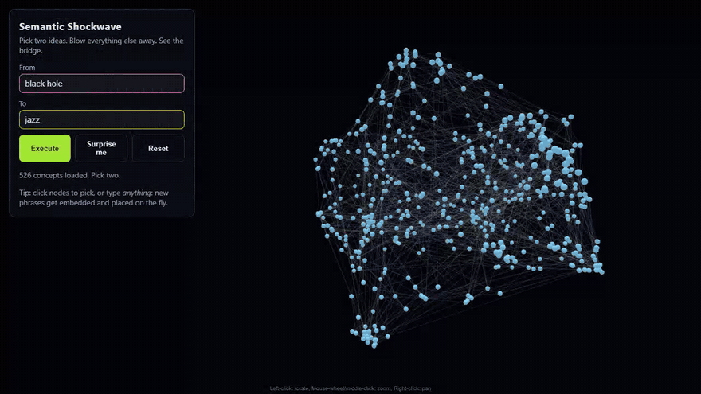
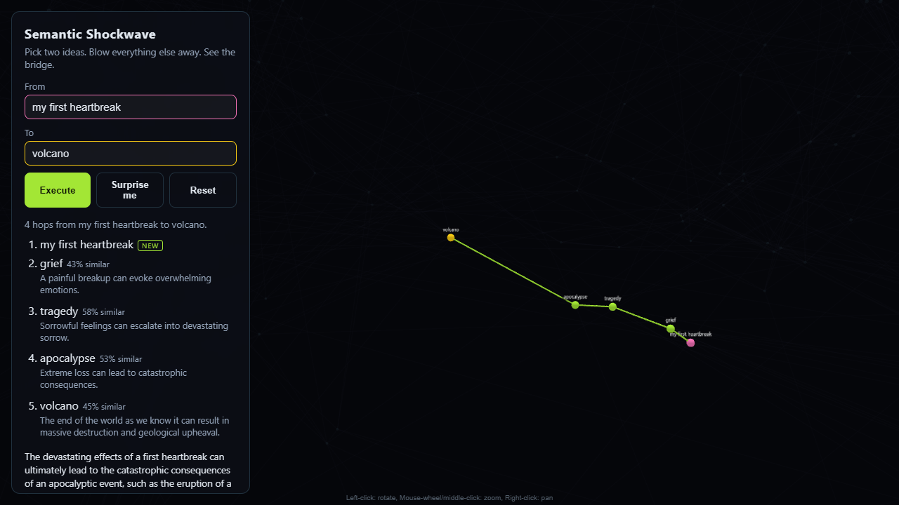
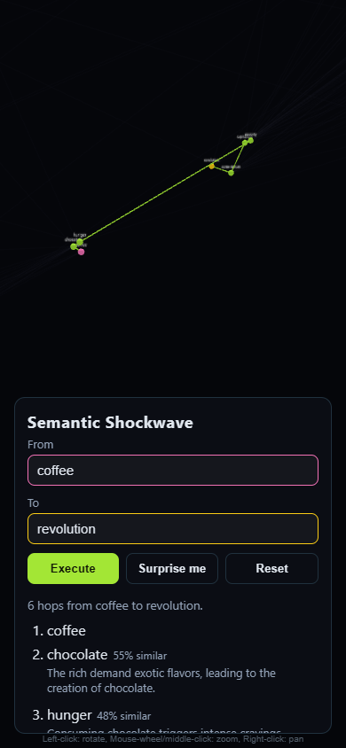

# Semantic Shockwave

**Pick two ideas, say *black hole* and *jazz*. Two particle streams race toward
each other, collide, and the blast throws every unrelated concept to the edge of
the universe. What's left glowing in the middle is the chain of stepping-stone
concepts that connects them, with an LLM explaining each step.**

Semantic Shockwave treats language as geometry. Concepts are embedded as
384-dimensional vectors, projected into a 3D cloud you can fly through, and
linked into a graph where the shortest path between two ideas is their
*semantic bridge*. You can also type any phrase at all ("my first heartbreak",
"rainy monday morning"); it gets embedded on the fly and dropped into the cloud.



| Free-text concepts | Phone layout |
|---|---|
|  |  |

---

## How it works

```
 concepts.txt ──► sentence-transformers ──► (N, 384) unit vectors ──┬──► UMAP ──► (N, 3) coordinates ─┐
                  all-MiniLM-L6-v2           cached to .npy         │   (reducer kept for .transform)  │
                                                                    └──► kNN + MST graph ──┐           │
                                                                                           ▼           ▼
 Browser (3d-force-graph) ◄────────── GET  /api/v1/space ───────────────────  FastAPI (built once at startup)
   │                                                                                ▲        │
   ├── pick A, B (or type anything) ── POST /api/v1/bridge ──► embed unknown text,  │        │
   │                                                          shortest path ────────┘        │
   └── after the blast ─────────────── POST /api/v1/narrate ──► Groq / Ollama (OpenAI-compatible) ─┘
```

1. **Embedding.** Every concept is encoded with
   [`all-MiniLM-L6-v2`](https://huggingface.co/sentence-transformers/all-MiniLM-L6-v2)
   and normalized to unit length, so a dot product equals cosine similarity. The
   vectors are cached to disk under a key that covers the model name and the
   exact vocabulary, so restarts skip the model and editing the list
   re-embeds automatically.
2. **Layout.** Browsers can't render 384 dimensions, so UMAP (cosine metric,
   fixed seed) reduces the vectors to 3D, and the cloud is scaled into a sphere.
   Because the seed is fixed, the same concept always lands in the same spot.
3. **The bridge graph.** Each concept connects to its *k* nearest neighbours.
   The edges of the **minimum spanning tree** are added on top, which guarantees
   the graph is connected: there is always a bridge, even between clusters that
   kNN alone would leave as islands.
4. **Routing.** The bridge is the weighted shortest path, with edge cost equal
   to **cosine distance squared**. Squaring makes two small conceptual steps
   cheaper than one big leap, so the path walks through intuitive neighbours
   instead of jumping straight across the space.
5. **Free-text concepts.** Anything not in the vocabulary (matched
   case-insensitively) is embedded on the spot, placed in the cloud with the
   fitted reducer's `UMAP.transform`, and linked to its *k* nearest concepts in
   a **per-request copy** of the graph. The shared graph is never mutated, so
   one visitor's phrases never leak into another's view.
6. **Narration.** The finished path goes to an LLM through any
   OpenAI-compatible endpoint (Groq hosted, or a local Ollama), which returns
   one sentence per hop plus a summary as validated JSON. Results are cached
   per path, so replays and shared links don't re-bill the LLM. With nothing
   configured, narration is simply off.
7. **The shockwave.** Nodes are pinned to their UMAP coordinates, so physics is
   off. On *Execute*:
   - **Collision:** two comet-tailed particle streams fire from the picks and
     accelerate into each other at the midpoint.
   - **Blast:** a flash and a shock ring go off at ground zero, and every
     concept off the bridge is flung outward (harder the closer it was) and
     fades.
   - **Extraction:** the camera glides in on the labelled, glowing path, with
     particles flowing along it, and the narration fills in hop by hop.

## Features

- 526-concept vocabulary spanning physics, nature, mind, tech, society, history and myth, art, food, places and abstract ideas
- Type any phrase: it's embedded, placed and routed live, and tagged `NEW` in the chain
- LLM narration of each hop (Groq or Ollama), optional
- Shareable links: `/?from=coffee&to=revolution` replays that bridge
- **Surprise me** picks two random concepts
- Click nodes to pick, or type with autocomplete
- Works on phones: the panel docks to the bottom and the camera frames the space above it
- One container serves the API and the frontend together

## Tech stack

| Layer | Tools |
|---|---|
| Embeddings | `sentence-transformers` (CPU PyTorch) |
| Dimensionality reduction | `umap-learn` |
| Graph + routing | `networkx`, NumPy (custom kNN + Prim's MST) |
| Narration | `httpx` to any OpenAI-compatible API (Groq, Ollama) |
| API | FastAPI, Uvicorn |
| Frontend | Vite, `3d-force-graph` + three.js, `three-spritetext`, vanilla JS |
| Tooling | `uv`, `pytest`, `ruff`, Docker, GitHub Actions |

## Run it locally

**Prerequisites:** Python 3.12+, [uv](https://docs.astral.sh/uv/), Node 20+.

```bash
# 1. Backend: http://127.0.0.1:8000
cd backend
uv sync                     # installs CPU-only torch (~200 MB, not the CUDA build)
uv run python -m shockwave  # first start downloads the model (~90 MB) and embeds the vocabulary
```

```bash
# 2. Frontend: http://localhost:5173 (proxies /api to the backend)
cd frontend
npm install
npm run dev
```

Open http://localhost:5173, then type or click two concepts and hit **Execute**.

**Or as one process:** run `npm run build` in `frontend/` and the backend
serves the built app itself at http://127.0.0.1:8000.

### Narration (optional)

Pick one:

```bash
# Groq (hosted, free tier): https://console.groq.com/keys
export GROQ_API_KEY=gsk_...

# Ollama (local): https://ollama.com, then `ollama pull llama3.2`
export SHOCKWAVE_LLM_BASE_URL=http://127.0.0.1:11434/v1
```

Then restart the backend. `GET /api/v1/health` reports whether narration is on.

### Configuration

| Variable | Default | Purpose |
|---|---|---|
| `SHOCKWAVE_CONCEPTS` | `backend/data/concepts.txt` | Vocabulary file (one concept per line, `#` comments) |
| `SHOCKWAVE_CACHE_DIR` | `backend/.cache` | Where embedding caches are stored |
| `SHOCKWAVE_FREE_TEXT` | `1` | `0` accepts vocabulary concepts only and skips loading the model at startup |
| `GROQ_API_KEY` | – | Turns on narration through Groq |
| `SHOCKWAVE_LLM_BASE_URL` | – | Any OpenAI-compatible endpoint; wins over Groq when set |
| `SHOCKWAVE_LLM_MODEL` | `openai/gpt-oss-20b` (Groq), `llama3.2` (other) | Narration model |
| `SHOCKWAVE_LLM_API_KEY` | – | Bearer token for `SHOCKWAVE_LLM_BASE_URL`, if it needs one |
| `SHOCKWAVE_STATIC_DIR` | `frontend/dist` | Built frontend to serve at `/` (skipped if missing) |
| `SHOCKWAVE_CORS_ORIGINS` | `http://localhost:5173` | Comma-separated allowed origins (only for split hosting) |
| `HOST` / `PORT` | `127.0.0.1` / `8000` | Backend bind address |
| `VITE_API_URL` (frontend build) | same origin | Backend base URL, if hosted separately |

See [`.env.example`](.env.example). Want your own universe? Edit
`backend/data/concepts.txt` and restart. The embeddings re-cache on their own.

## Docker

```bash
docker build -t semantic-shockwave .
docker run -p 7860:7860 semantic-shockwave                    # http://localhost:7860
docker run -p 7860:7860 -e GROQ_API_KEY=gsk_... semantic-shockwave   # with narration
```

The image builds the frontend, installs CPU-only torch, and bakes the model and
vocabulary embeddings in, so a container starts without network access. It
listens on port 7860 as uid 1000, which is what
[Hugging Face Spaces](https://huggingface.co/docs/hub/spaces-sdks-docker)
expects. See [docs/DEPLOY.md](docs/DEPLOY.md) for hosting it there for free.

## API

| Method | Path | Body | Returns |
|---|---|---|---|
| `GET` | `/api/v1/health` | – | `{"status": "ok", "free_text": bool, "narration": bool}` |
| `GET` | `/api/v1/space` | – | `{nodes: [{id, x, y, z}], links: [{source, target, similarity}]}` |
| `POST` | `/api/v1/bridge` | `{"source": "black hole", "target": "jazz"}` | `{path: [...], hops: [{source, target, similarity}], placed: [{id, x, y, z}]}` |
| `POST` | `/api/v1/narrate` | `{"path": ["black hole", "dark matter", ...]}` | `{steps: [...one per hop], summary}` |

- `placed` lists free-text concepts that were embedded for this request, with their coordinates.
- Concepts are 1–60 characters. Blank or oversized input returns `422`.
- With free text off, an unknown concept returns `404`.
- Narration returns `503` when no LLM is configured and `502` when the LLM fails or returns malformed output.

Interactive docs are at http://127.0.0.1:8000/docs.

## Tests

```bash
cd backend
uv run pytest      # 38 tests: routing, free text, narration, API, cache, layout. No model or LLM needed.
uv run ruff check .
```

The tests use synthetic vectors (points along an arc, two separated clusters)
to check routing properties exactly:

- the bridge visits every intermediate step on the arc
- the MST joins clusters that kNN leaves disconnected
- free-text concepts never leak into the shared graph
- the LLM client is exercised against a mocked HTTP transport, including bad JSON, wrong step counts, HTTP errors and caching

CI runs the backend tests and lint, the frontend build and the Docker build on
every push.

## Project layout

```
backend/
  src/shockwave/
    app.py          FastAPI app, startup assembly (build_space), free-text resolution
    bridge.py       kNN + MST graph, squared-distance shortest path, per-request extras
    embeddings.py   sentence-transformers wrapper, on-disk cache, lazy query embedder
    layout.py       UMAP → 3D, fit to sphere, place new points
    narrate.py      OpenAI-compatible LLM client + JSON validation
    concepts.py     vocabulary loader
  data/concepts.txt
  tests/
frontend/
  src/main.js       3D scene, collision/blast/extraction animation, UI wiring
  src/style.css
docs/               demo GIF, screenshots, deployment guide
Dockerfile          single-container build (frontend + backend)
```

## Roadmap

- [x] **Collision phase:** particle streams fire from both picks and collide at the midpoint before the blast.
- [x] **LLM narration:** Groq or a local Ollama explains *why* each hop connects.
- [x] **Free-text concepts:** embed any phrase on the fly and place it with `UMAP.transform`.
- [x] Demo GIF in this README.
- [ ] **Hosted demo** on Hugging Face Spaces (container is ready; see [docs/DEPLOY.md](docs/DEPLOY.md)).
- [ ] Stream narration token by token instead of waiting for the whole answer.

## License

[MIT](LICENSE)
